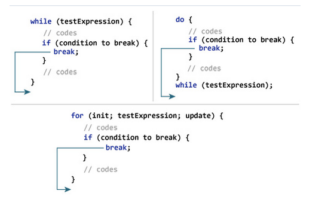

# Static
## Một số lưu ý về biến static
1. Các biến tĩnh được tạo khi bắt đầu thực thi chương trình và tự động bị hủy sau khi thực thi chương trình.
2. Không giống như các biến thể hiện, chỉ có một bản sao của biến ***\"static\"*** cho mỗi lớp bất kể số lượng đối tượng mà chúng ta tạo ra từ lớp đó
3. Việc khởi tạo biến tĩnh là không bắt buộc. Nếu ta không khởi tạo nó bằng một giá trị, nó sẽ nhận một giá trị mặc định tương tự như các biến cá thể
4. Chúng ta có thể các biến ***\"static\"*** bằng cách gọi nó với tên lớp `ClassName.variableName`.

# assert 
>Là keyword có từ java 1.4 được sử dụng để kiểm tra một biểu thức có đúng hay không, thường được sử dụng để viết trong code unit test

# break
Dùng để chấm dứt vòng lặp ngay lập tức và luồng điều khiển chương trình chuyển sang câu lệnh tiếp theo trong vòng lặp
## Lệnh break hoạt động với một vòng lặp

## Lệnh break hoạt động với vòng lặp lồng nhau
Đối với các vòng lặp lồng nhau , câu lệnh break sẽ chấm dứt vòng lặp trong cùng.