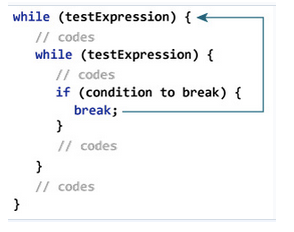

# 1. Static
## 1.1. Một số lưu ý về biến static
1. Các biến tĩnh được tạo khi bắt đầu thực thi chương trình và tự động bị hủy sau khi thực thi chương trình.
2. Không giống như các biến thể hiện, chỉ có một bản sao của biến ***\"static\"*** cho mỗi lớp bất kể số lượng đối tượng mà chúng ta tạo ra từ lớp đó
3. Việc khởi tạo biến tĩnh là không bắt buộc. Nếu ta không khởi tạo nó bằng một giá trị, nó sẽ nhận một giá trị mặc định tương tự như các biến cá thể
4. Chúng ta có thể các biến ***\"static\"*** bằng cách gọi nó với tên lớp `ClassName.variableName`.

# 2. assert 
>Là keyword có từ java 1.4 được sử dụng để kiểm tra một biểu thức có đúng hay không, thường được sử dụng để viết trong code unit test

# 3. break
Dùng để chấm dứt vòng lặp ngay lập tức và luồng điều khiển chương trình chuyển sang câu lệnh tiếp theo trong vòng lặp

## 3.1. Lệnh break hoạt động với một vòng lặp


## 3.2. Lệnh break hoạt động với vòng lặp lồng nhau
Đối với các vòng lặp lồng nhau , câu lệnh break sẽ chấm dứt vòng lặp trong cùng.

> Cơ chế của break có thể hiểu đơn giản là nó sẽ tìm đến vòng lặp gần với nó nhất và chấm dứt vòng lặp đó và chuyển sang câu lệnh tiếp theo của vòng lặp.

## 3.3. Lệnh break có nhãn

Khi câu lệnh break second; được thực hiện, vòng lặp while có nhãn second bị chấm dứt. Và luồng điều khiển của chương trình chuyển sang câu lệnh sau vòng lặp while thứ hai .

# 4. Continue
* Được sử dụng để tiếp tục vòng lặp tại điều kiện đã được xác định, với điều kiện đó khối lượng phía sau từ khóa continue sẽ không được thực thi
* Giống như break với vòng lặp lồng nhau nó sẽ tìm đến vòng lặp gần nhất để thực thi

## 4.1. Lệnh continue hoạt động với một vòng lặp

## 4.2. Lệnh continue hoạt động với vòng lặp lồng nhau

## 4.3. Lệnh continue lable


# 5. enum
Enum là một kiểu dữ liệu đặc biệt cho phép một biến có thể là một tập hợp các hằng số định sẵn
```c
public enum Day {
     SUNDAY, MONDAY, TUESDAY, WEDNESDAY,
     THURSDAY, FRIDAY, SATURDAY 
}
```
# 6. final
1. **Biến final**: Không thể thay đổi giá trị (nó sẽ là hằng số)
2. **Phương thức final**: Không thể ghi đè phương thức final
3. **Class final**: Không thể kế thừa class final

# 7. Synchronized
Chỉ ra là ở mỗi thời điểm chỉ có 1 đối tượng hay 1 lớp có thể truy nhập đến biến dữ liệu hoặc phương thức loại đó – Thường được sử dụng trong lập trình đa luồng (multithreading).

