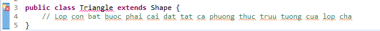
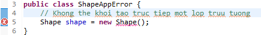

# 1. Định nghĩa
abstract có nghĩa là chúng ta đi tổng quát hóa một cái gì đó mà không cần đi vào chi tiết quá vào nó, nhưng người nghe vẫn hiểu được nó là cái gì. Trong OOP thì tính trừu tượng là ta đi lựa chọn các thuộc tính và các phương thức cần thiết của đối tượng để giải quyết bài toán. Bởi trong thực tế có rất nhiều thuộc tính và phương thức nhưng không liên quan và không cần sử dụng trong bài toán đề ra
*Ví dụ 5*: trong bài toán quản lý mèo, chẳng hạn đối tượng mèo chúng ta chỉ cần khái quát nó thành 1 lớp kiểu:
```java
public class cat{
    // Các thuộc tính
    private int ID;
    private String species; // chủng loại
    private String origin; // Xuất xứ
    private double weight; // cân nặng

    // Các phương thức
    public void input(){
    }

    public void output(){
    }
}
```

Chúng ta không cần thiết phải nhảy vào chi tiết thuộc tính kiểu: số lông, số chân, số ngón chân trên mỗi bàn chân, số tai, số mắt, ... hay các phương thức kiểu: ăn, di chuyển, ... Nhưng người nghe vẫn hiểu được nó là con mèo là đủ và quan trọng hơn, các thuộc tính phương thức mà chúng ta tạo ra đều có thể được sử dụng đến để giải quyết bài toán quản lý mèo.

# 2. Abstract class và interface
## 2.1. Lớp trừu tượng (abstract class)
### 2.1.1. Đặc điểm
* Một lớp trừu tượng được khai báo với từ khóa abstract
* Lớp trừu tượng có thể có các phương thức abstract hoặc non-abstract
* Lớp trừu tượng có thể khai báo 0,1 hoặc nhiều method trừu tượng bên trong
* Không thể khởi tạo 1 đối tượng trực tiếp từ một class abstract
* Một lớp kế thừa từ lớp trừu tượng(subclass - class con) không cần phải implement non-abstract methods, nhưng những method nào có abstract thì buộc phải override. Trừ khi subclass cũng là abstract 

:memo: Cú pháp:
```java
<PhamViTruyCap> abstract class <TenLop> {
     
}
```
### 2.1.2. Phương thức lớp trừu tượng

* Một phương thức được khai báo là abstract và không có trình triển khai thì đó là một phương thức trừu tượng(abstract method).
* Nếu bạn muốn một lớp chứa một phương thức cụ thể nhưng bạn muốn triển khai thực sự phương thức đó để được quyết định bởi các lớp con, thì bạn có thể khai báo phương thức đó trong lớp cha ở dạng abstract.
* Từ khóa abstract được sử dụng để khai báo một phương thức dạng abstract. Phương thức abstract sẽ không có định nghĩa, được theo sau bởi dấu chấm phẩy không có dấu ngoặc nhọn theo sau.

:memo: Cú pháp:
```java
<PhamViTruyCap> abstract void <TenPhuongThuc>();
```

### 2.1.3. Ví dụ về lớp trừu tượng và phương thức trừu tượng

Ví dụ: Viết chương trình vẽ một hình bất kỳ với màu đỏ, sao cho cách sử dụng là giống nhau, bất kể đó là hình gì. Hình đó có thể là hình chữ nhật (rectangle), hình tròn (circle), tam giác (triangle), đường (line), …

Với yêu cầu trên, tôi tạo một lớp trừu tượng Shape. Lớp này cung cấp một phương thức trừu tượng draw, phương thức này để đảm bảo rằng tất cả các hình đều có cùng cách sử dụng (draw). Ngoài ra, có phương thức không trừu tượng getColor để cung cấp màu sử dụng chung cho tất cả các hình. Tiếp theo, tôi tạo 2 lớp Rectangle và Circle kế thừa từ lớp Shape, 2 lớp này có những cách xử lý draw khác nhau. Cuối cùng, tôi tạo class ShapeApp, gọi phương thức draw để vẽ hình theo yêu cầu.

Shape.java
```java
public abstract class Shape {
    private String color = "red";
     
    public Shape() {
         
    }
     
    public abstract void draw();
     
    public String getColor() {
        return color;
    }
}
```
Rectangle.java
```java
public class Rectangle extends Shape {
 
    @Override
    public void draw() {
        System.out.println("Draw " + super.getColor() + " rectangle");
    }  
}
```
Circle.java
```java
public class Circle extends Shape {
 
    @Override
    public void draw() {
        System.out.println("Draw " + super.getColor() + " circle");
    }
}
```
ShapeApp.java
```java
public class ShapeApp {
    public static void main(String[] args) {
        Shape rect = new Rectangle();
        rect.draw();
        System.out.println("---");
        Shape circle = new Circle();
        circle.draw();      
    }
}
```
Kết quả:
```text
Draw red rectangle
---
Draw red circle
```

### 2.1.4. Một vài lưu ý
**Lớp con bắt buộc phải cài đặt (implement) tất cả các phương thức trừu tượng của lớp cha**

Bạn nhận được thông báo lỗi nếu lớp con không cài đặt (implement) tất cả các phương thức trừu tượng của lớp cha: *The type Triangle must implement the inherited abstract method Shape.draw().*



**Không thể khởi tạo trực tiếp một lớp trừu tượng**

Bạn nhận được thông báo lỗi khi cố tình khởi tạo một lớp trừu tượng: *Cannot instantiate the type Shape.*



## 2.2. Interface trong java
:bulb: Đặc điểm của Interface
* Các phương thức interface đều là phương thức trừu tượng
* Interface là một kỹ thuật để thu được tính trừu tượng hoàn toàn và đa kế thừa trong java
* Interface luôn luôn có modifier là:***public interface***, cho dù bạn có khai báo rõ hay không
* Nếu có các trường(field) thì chúng đều là: ***public static final***, cho dù bạn có khai báo rõ hay không
* Interface không có hàm khởi tạo(constructor).
* Một interface không phải là một lớp. Viết môt interface giống như viết một class, nhưng chúng có 2 định nghĩa khác nhau. Một lớp mô tả các thuộc tính và hành vi của một đối tượng. Một interface chứa các hành vi mà một class triển khai.
* Trừ khi một lớp triển khai interface là lớp trừu tượng abstract, còn lại tất cả các phương thức của interface cần được định nghĩa trong class.

>Java Compiler thêm từ khóa ***public abstract*** trước phương thức của interface và các từ khóa ***public static final*** trước các thành viên dữ liệu

:bulb: Điểm giống và khác nhau giữa interface và class
|   | Mô tả  |
|---|---|
| Giống nhau | 1.Một interface được viết trong một file vói định dạng .java, với tên của interface giống tên của file.<br/>2.Bytecode của interface được lưu trong file có định dạng .class<br/> 3.Khai báo interface trong một package, những file bytecode tương ứng cũng có cấu trúc thư mục có cùng tên package.|
| Khác nhau | 1. Bạn không thể khởi tạo một interface.<br/>2.Một interface không chứa bất kỳ hàm **constructor** nào.<br/>3.Tất cả các phương thức của interface đều là abstract.<br/> 4.Một interface không thể chứa một trường nào trừ các trường vừa **static** và **final**.<br/>4.Một interface không thể kế thừa từ lớp, nó được triển khai bởi một lớp.<br/> 5.Một interface có thể kế thừa từ nhiều interface khác.|

### 2.2.1. Ví dụ sử dụng Interface trong Java
Shape.java
```java
public interface Shape {
     
    String color = "red";
     
    void draw();    
}
```
Rectangle.java
```java
public class Rectangle implements Shape {
 
    @Override
    public void draw() {
        System.out.println("Draw " + color + " rectangle");
    } 
}
```
Circle.java
```java
public class Circle implements Shape {
 
    @Override
    public void draw() {
        System.out.println("Draw " + color + " circle");
    }
}
```
ShapeApp.java
```java
public class ShapeApp {
    public static void main(String[] args) {
        Shape rect = new Rectangle();
        rect.draw();
        System.out.println("---");
        Shape circle = new Circle();
        circle.draw();      
    }
}
```
Kết quả:
```text
Draw red rectangle
---
Draw red circle
```

:bulb: Một số quy tắc khi override method được định nghĩa trong interface
* Các checked exception không nên được khai báo trong phương thức implements, thay vào đó nó nên được khai báo trong phương thức interface hoặc các lớp phụ được khai báo bởi phương thức interface.
* Signature (ký số) của phương thức interface và kiểu trả về nên được duy trì khi ghi đè phương thức (overriding method).
* Một lớp triển khai chính nó có thể là abstract và vì thế các phương thức interface không cần được triển khai.

:bulb: Một vài quy tắc khi triển khai interface
* Một lớp có thể triển khai một hoặc nhiều interface tại một thời điểm
* Một lớp chỉ có thể kế thừa một lớp khác, nhưng có thể triển khai với nhiều interface
* Một interface có thể kế thừa từ một interface khác, tương tự cách một lớp có thể kế thừa lớp khác.

### Đa thừa kế trong Java bởi Interface
* Nếu một lớp triển khai đa kế thừa, hoặc một Interface kế thừa từ nhiều Interface thì đó là đa kế thừa
* Trong Java, một lớp chỉ được thừa kế (extends) từ một lớp, có thể cài đặt (implements) nhiều interface. Tuy nhiên, một interface có thể thừa kế (extends) nhiều interface.
* Một interface không thể cài đặt (implements) interface khác, do interface không phần cài đặt, chỉ chứa các khai báo.


:dash: Ví dụ một lớp cài đặt (implements) nhiều interface:
```java
public interface Shape {    
    void draw();    
}
 
public interface Color {
    String getColor();
}
 
public class Rectangle implements Shape, Color {
 
    @Override
    public void draw() {
        System.out.println("Draw " + this.getColor() + " rectangle");
    }
 
    @Override
    public String getColor() {
        return "red";
    }  
}
```
:dash: Ví dụ interface kế thừa (extend) nhiều interface
```java
public interface Shape {    
    void draw();    
}
 
public interface Color {
    String getColor();
}
 
public interface ShapeColor extends Shape, Color {
 
}
 
public class Circle implements ShapeColor {
 
    @Override
    public void draw() {
        System.out.println("Draw " + this.getColor() + " circle");
    }
 
    @Override
    public String getColor() {
        return "red";
    }  
}
```

:dash: Ví dụ đa thừa kế với Interface
```java
public interface Printable {  
    void print();  
} 
  
public interface Showable {  
    void print();  
}  
    
public class InterfaceDemo implements Printable, Showable {  
    public void print() {
        System.out.println("Welcome to gpcoder.com");
    }  
 
    public static void main(String args[]) {  
        InterfaceDemo obj = new InterfaceDemo();  
        obj.print();  
    }  
}  
```
Trong ví dụ trên, interface Printable và Showable có cùng các phương thức print() nhưng trình triển khai của nó được cung cấp bởi lớp InterfaceDemo, vì thế không có tính lưỡng nghĩa ở đây.

:dash: Ví dụ đa thừa kế với class
```java
public class Printable {
    void print() {
        System.out.println("Printable");
    }
}  
 
public class Showable {  
    void print() {
        System.out.println("Showable");
    }
}  
 
// Không thể thực hiện đa thừa kế với class
public class InterfaceDemo extends Printable, Showable {  
    public static void main(String args[]) {  
        InterfaceDemo obj = new InterfaceDemo();  
        obj.print();  // Không thể xác định được gọi phương thức print() của class nào
    }  
}  
```

### Marker (hay Tagging) Interface trong Java là gì?
Đó là một Interface mà không có thành viên nào. Ví dụ: Serializable, Cloneable, Remote, … Chúng được sử dụng để cung cấp một số thông tin thiết yếu tới JVM để mà JVM có thể thực hiện một số hoạt động hữu ích.

:dash: Expamle
```java
public interface Serializable {  
}  
```
Có hai mục đích thiết kế chủ yếu của tagging interface là:
* Tạo một cha chung: Như với EventListener interface, mà được kế thừa bởi hàng tá các interface khác trong Java API, bạn có thể sử dụng một tagging interface để tạo một cha chung cho một nhóm interface. Ví dụ, khi một interface kế thừa EventListener, thì JVM biết rằng interface cụ thể này đang được sử dụng trong một event.
* Thêm một kiểu dữ liệu tới một class: Đó là khái niệm tagging. Một class mà triển khai một tagging interface không cần định nghĩa bất kỳ phương thức nào, nhưng class trở thành một kiểu interface thông qua tính đa hình (polymorphism).

### Interface lồng nhau trong Java
```java
interface Printable {
    void print();
 
    interface MessagePrintable {
        void msg();
    }
}
```

## So sánh abstract class và interface trong Java
| Lớp trừu tượng (abstract class) | Interface |
|---|---|
| Thể hiện tính trừu tượng **< 100%** | Thể hiện tính trừu tượng 100% **(Java < 8)**. |
| Lớp trừu tượng có thể có các phương thức **abstract** và **non-abstract** | Phiên bản **Java < 8**, Interface chỉ có thể có phương thức abstract.<br/> Phiên bản **Java 8**, có thể thêm **default** và **static methods**.<br/> Phiên bản **Java 9**, có thể thêm **private methods**. |
| Lớp trừu tượng **không** hỗ trợ **đa kế thừa** | Interface **hỗ trợ đa kế thừa** |
| Lớp trừu tượng có thể có các biến **final**, **non-final**, **static** và **non-static** | Interface chỉ có các biến **static final** |
| Lớp trừu tượng **có thể có** phương thức **static**, **method main** và **constructor** | Interface **không thể có** phương thức **static**, **main** hoặc **constructor**. |
| Từ khóa **abstract** được sử dụng để khai báo lớp trừu tượng | Từ khóa **interface** được sử dụng để khai báo Interface |
| **Sử dụng Abstract class** **khi** chúng ta chỉ **có thể hoàn thành** một vài chức năng **(method/ function)** **chuẩn** của **hệ thống**, một vài chức năng còn lại các lớp extends phải hoàn thành. Những tính năng đã hoàn thành này vẫn sử dụng như bình thường, đây là những tính năng chung. | Sử dụng Interface khi bạn muốn tạo dựng một bộ khung chuẩn gồm các chức năng (method/ function) mà tất cả module/ project cần phải có. Các module phải implements tất cả chức năng đã được định nghĩa. |

Nói về Abtract Class và Interface, đôi khi bạn sẽ gặp một số cách gọi: Khi một class **extend** một class/ abtract class thì có nghĩa là ta đang thể hiện mối quan hệ **is-a** (là), còn khi **implement** một interface, thì ta đang thể hiện mối quan hệ **has-a** (có, hay thực hiện).

```java
// Programmer là Person, thực hiện việc Programming, Debugging
 
class Programmer extends Person implements Programming, Debugging {}
 
// Rectangle là Shape, có Width, Height
 
class Rectangle extends Shape implements Width, Height {}
```


