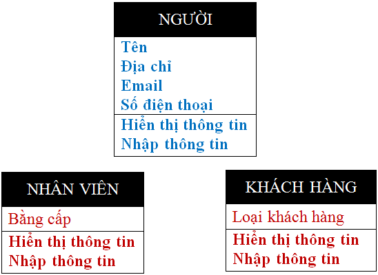
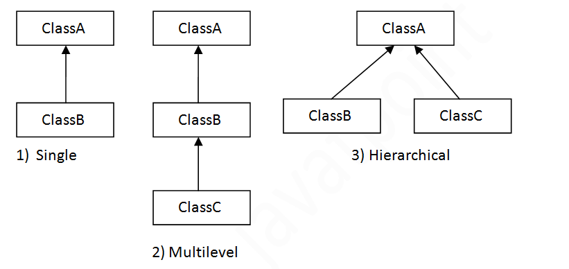
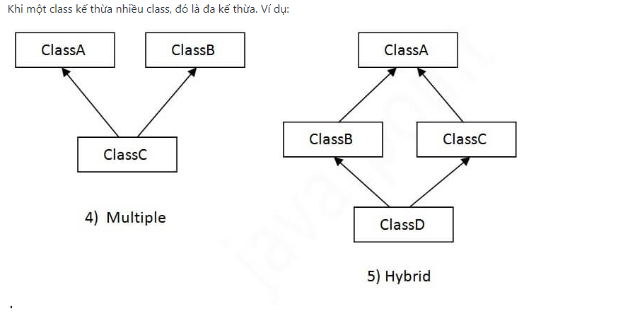

# 1. Định nghĩa
Bản chất kế thừa (inheritance) là phát triển lớp mới dựa trên các lớp đã có. Xây dựng các lớp mới có sẵn các đặc tính của lớp cũ, đồng thời lớp mới có thể mở rộng các đặc tính của nó.
Tính kế thừa thể hiện quan hệ **IS-A**, còn gọi là quan hệ cha-con.

:bulb: **Các thuật ngữ**
* **Class**: Class là một tập hợp các đối tượng có chung tính chất. Nó là một bản mẫu hay một bản thiết kế mà từ đó các đối tượng được tạo ra.
* **Class con (Sub class/Child class)**: Class con là một class kế thừa từ class khác. Một số thuật ngữ khác để gọi class con trong tiếng Anh là “derived class”, “extended class”, hay “child class”.
* **Class cha (Super class/Parent class)**:Class cha là class được class con kế thừa. Một số thuật ngữ khác để gọi class cha trong tiếng Anh là “base class” hay “parent class”.
* **Tính tái sử dụng**:Như tên gọi, tính tái sử dụng là cơ thế cho phép bạn sử dụng lại các trường và phương thức của class hiện tại khi bạn tạo một class mới. Bạn có thể sử dụng cùng trường và phương thức đã được định nghĩa ở class cha.

:memo: **Cú pháp**
```java
class Subclass-name extends Superclass-name  
{  
   //methods and fields  
}  
```
**Từ khoá extends** chỉ ra rằng bạn đang tạo một class mới từ một class có sẵn. “extends” nghĩa là mở rộng các chức năng.
Trong thuật ngữ của Java, class được kế thừa gọi là class cha (parent class/super class), và class mới được gọi là class con (child class/subclass).

# 2. Bảng phạm vi truy cập và nguyên lý kế thừa trong Java
| Access Modifier | within class | within package | outside package by subclass only | outside package |
|---|---|---|---|---|
| **Private** | :heavy_check_mark: | :x: | :x: | :x: | 
| **Default** | :heavy_check_mark: | :heavy_check_mark: | :x: | :x: |
| **Protected** | :heavy_check_mark: | :heavy_check_mark: | :heavy_check_mark: | :x: |
| **Public** | :heavy_check_mark: | :heavy_check_mark: | :heavy_check_mark: | :heavy_check_mark: |


:star: **Ví dụ về tính kế thừa trong Java**

Lớp **NHÂN VIÊN** kế thừa từ lớp **NGƯỜI**, lớp **KHÁCH HÀNG** kế thừa từ lớp **NGƯỜI** thì một đối tượng **NHÂN VIÊN** là một **NGƯỜI**, một đối tượng **KHÁCH HÀNG** là một **NGƯỜI**. Nhưng một đối tượng **NGƯỜI** chưa chắc là **NHÂN VIÊN** bởi vì có thể đối tượng **NGƯỜI** đó là **KHÁCH HÀNG**. Tương tự, môt đối tượng **NGƯỜI** chưa chắc là **KHÁCH HÀNG** bởi vì có thể đối tượng **NGƯỜI** đó là **NHÂN VIÊN**.

# 3. Các kiểu kế thừa trong Java
Trên cơ sở class, có ba kiểu kế thừa trong Java: đơn kế thừa, kế thừa nhiều cấp, kế thừa thứ bậc.
Trong Java, đa kế thừa và kế thừa hỗn hợp chỉ được hỗ trợ thông qua interface.


> :boom: Chú ý: Đa kế thừa trong Java không được hỗ trợ thông qua class.



:black_nib: **Ví dụ về đơn kế thừa**
Đơn kế thừa là khi một class kế thừa một class khác. Ở ví dụ dưới đây, Dog class thừa kế Animal class vì thế đây. là đơn kế thừa
File: TestInheritance.java
```java
class Animal {  
   void eat() {System.out.println("eating...");}  
} 

class Dog extends Animal {  
   void bark() {System.out.println("barking...");}  
}  

class TestInheritance {  
   public static void main(String args[]) {  
      Dog d = new Dog();
      d.bark();  
      d.eat();  
   }
}
```
:memo: **Kết quả**
```text
barking...
eating...
```
:black_nib: **Ví dụ về kế thừa nhiều cấp**
Kế thừa nhiều cấp là khi có một chuỗi kế thừa. Ở ví dụ dưới đây, BabyDog class kế thừa Dog class mà class này lại kế thừa Animal class, vì thế đây là kế thừa nhiều cấp.
File: TestInheritance2.java

```java
class Animal {  
   void eat() {System.out.println("eating...");}  
} 

class Dog extends Animal {  
   void bark() {System.out.println("barking...");}  
}

class BabyDog extends Dog {  
   void weep() {System.out.println("weeping...");}  
}  

class TestInheritance2 {  
   public static void main(String args[]) {  
      BabyDog d = new BabyDog();
      d.weep();
      d.bark();  
      d.eat();  
   }
}
```
:memo: **Kết quả**
```text
weeping...
barking...
eating...
```

:black_nib: **Ví dụ về kế thừa thứ bậc**
Kế thừa thứ bậc là khi có từ hai class trở lên kế thừa một class. Ở ví dụ dưới đây, các class Dog và Cat kế thừa Animal class, vì thế đây là kế thừa thứ bậc.
File: TestInheritance.java
```java
class Animal {  
   void eat() {System.out.println("eating...");}  
} 

class Dog extends Animal {  
   void bark() {System.out.println("barking...");}  
}

class Cat extends Animal {  
   void meow() {System.out.println("meowing...");}  
}

class TestInheritance3 {  
   public static void main(String args[]) {  
      Cat c=new Cat();  
      c.meow();  
      c.eat();
   }
}
```
:memo: **Kết quả**
```text
meowing...
eating...
```
# Tại sao đa kế thừa không được hỗ trợ trong Java?
Đa kế thừa không được hỗ trợ trong Java để giảm sự phức tạp và đơn giản hoá ngôn ngữ.
Hãy xem trường hợp có ba class A, B, C. Class C thế thừa từ class A và B. Nếu class A và B có cùng phương thức và bạn gọi nó từ đối tượng của class con, sẽ không thể biết được đang gọi phương thức của class A hay B.
Vì compile-time errors tốt hơn là runtime errors, Java sẽ ném ra compile-time error khi bạn kế thừa 2 class. Dù bạn có phương thức giống hay khác nhau, compile error vẫn sẽ được ném ra.

```java
class A{  
   void msg() {System.out.println("Hello");}  
}  

class B{  
   void msg() {System.out.println("Welcome");}  
}  

class C extends A, B { // suppose if it were
   
public static void main(String args[]) {  
      C obj = new C();
      obj.msg(); // Now which msg() method would be invoked?  
   }  
}
```
:memo: **Kết quả**
```text
Compile Time Error
```
